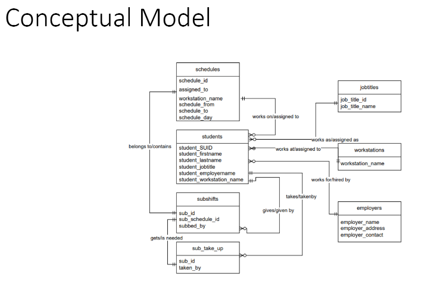
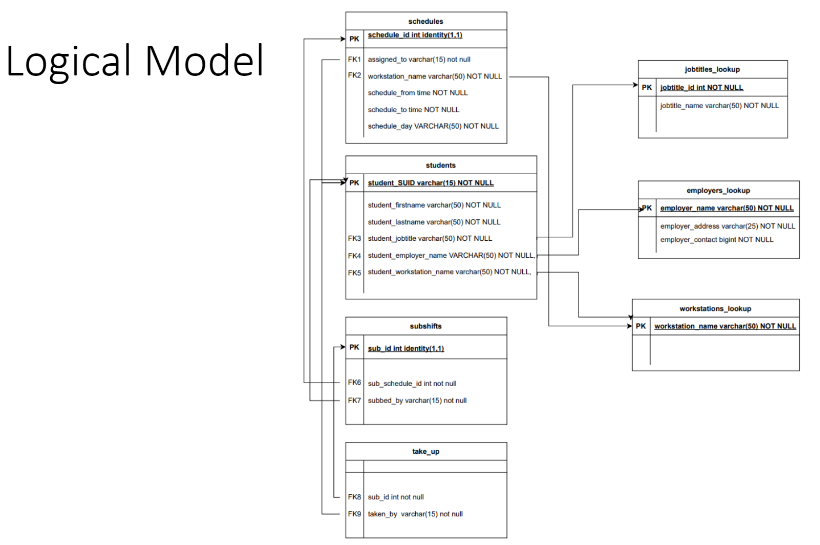
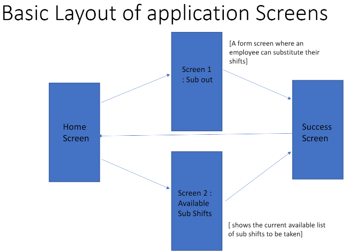
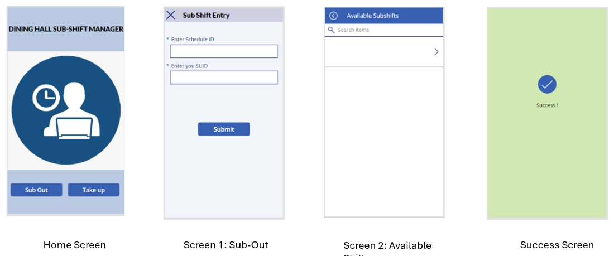

## Overview
This repository contains the resources and scripts for the Capstone Project on employee scheduling management. The project focuses on optimizing shift management through a structured database solution, ensuring efficient scheduling and resource allocation within organizations.

## Project Development Process
The development process of this project involved several key phases:

1. **Requirement Gathering**: Collaborated with stakeholders to understand their needs regarding employee scheduling and shift management.
2. **Design**: Created both conceptual and logical designs of the database schema to accurately reflect the relationships and requirements.
3. **Implementation**: Developed SQL scripts to create the database and implement the required functionalities.
4. **Testing**: Conducted thorough testing of the database to ensure that all functionalities work as intended and meet the project's requirements.
5. **Deployment**: Deployed the final solution on Azure for scalability and accessibility.

## Schema 
### Conceptual Model

### Logical Model

## Folder Structure

- **README.md**: This file provides an overview of the repository.
- **archives/**: Contains archived files and previous versions of project documents.
- **artifacts/**: Contains artifacts related to the project, such as deployment scripts or compiled applications.
- **database/**: Holds all database-related scripts and files:
  - `final_script.sql`: The final version of the SQL script for database creation and management.
  - `final_script_on_azure.sql`: The final version of the SQL script tailored for deployment on Azure.
  - `project-updated.sql`: An updated version of the project script with recent changes and enhancements.
  - `project_script.sql`: The initial script used for the project, prior to any updates.
  - `subshift_management_project_ist659_bjob01.sql`: Specific SQL script related to the subshift management project.
- **design/**: Contains design documents and diagrams related to the database schema:
  - **Schema**:
    - **E-R Requirements Spreadsheet.xlsx**: Spreadsheet outlining the entity-relationship requirements for the project, capturing all necessary entities and their attributes.
    - **ER_Conceptual.pdf**: Conceptual design document illustrating the high-level structure of the database, including entities, relationships, and major functionalities.
    - **ER_Logical.pdf**: Logical design document detailing the logical structure of the database, including primary and foreign keys, normalization processes, and constraints.
- **presentations/**: Contains presentation materials related to the project.
- **artifacts/**: Contains artifacts that support the project.
- **archives/**: Holds archived documents and versions of files.

## Results of the Application Design
The application design yielded several significant results:

- **Improved Shift Management**: The system allows managers to efficiently allocate shifts, reducing scheduling conflicts and enhancing employee satisfaction.
- **User-Friendly Interface**: A straightforward interface enables users to easily navigate and manage their schedules.
- **Scalability**: The database design is structured to accommodate future growth, allowing the addition of new features or scaling to larger user bases without performance degradation.
- **Data Integrity**: Implemented constraints and relationships ensure the integrity and accuracy of the data stored in the database.

## Installation
To set up the project, clone the repository and run the SQL scripts located in the `database/` directory to create the necessary database structure.

## Usage
Follow the guidelines outlined in the presentations to implement and use the employee scheduling management system.

## License
This project is licensed under the MIT License - see the [LICENSE](LICENSE) file for details.
